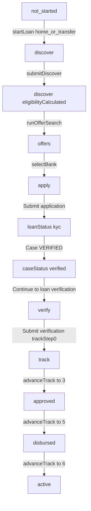
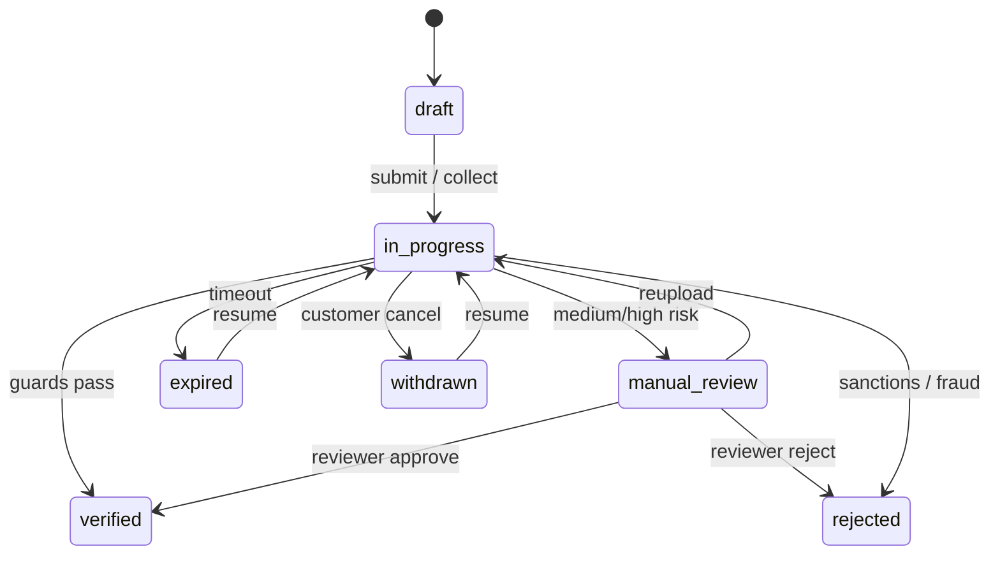

# AAMPAY state machine

> **Scope:** Interactive home-loan prototype (`src/`). Local React state only — no real APIs, OTP, or file storage.  
> **Audience:** Backend / platform engineers mapping UI → domain model.  
> **Source of truth:** [`src/lib/types.ts`](src/lib/types.ts), [`src/lib/state.tsx`](src/lib/state.tsx), [`src/components/AppShell.tsx`](src/components/AppShell.tsx), screens under [`src/components/screens/`](src/components/screens/).

### How to read `Path`

Dotted hierarchy from outer container → leaf. Example:

`User.NRI.Loan.home.Journey.KYC.docs.selfie`

Sibling branches (Resident vs NRI, home vs transfer) share the same loan status machine; only KYC docs/address/compliance fields diverge.

### Legends

| Token | Meaning |
|---|---|
| `LoanStatus` | `not_started` → `discover` → `offers` → `apply` → `kyc` → `verify` → `track` → `approved` → `disbursed` → `active` |
| `JourneySheet` | `null` \| `discover` \| `apply` \| `kyc` \| `verify` \| `track` (bottom sheet on My Loan) |
| `DocStatus` (KYC) | `not_started` ↔ `uploaded`; also seedable `under_review` / `accepted` / `rejected` / `expired` (reject/expire require re-upload) |
| `DocStatus` (verify) | `not_started` → `uploaded` → `under_review` → `accepted` → (cycle) |
| Progress % | `not_started` 0 · `discover` 15 · `offers` 30 · `apply` 45 · `kyc` 55 (70 if `kyc.complete`) · `verify` 80 · `track` 90 · `approved` 95 · `disbursed` 98 · `active` 100 |

### UI architecture (one sentence)

**My Loan (`overview`)** is the home; journey forms open in a **bottom sheet** (`state.sheet`); when `loanStatus` ∈ {`track`,`approved`,`disbursed`,`active`}, overview **replaces** step cards with the loan-tracking panel. Profile holds all collected identity / docs for edit.

---

## Master state table

| Path | State / status | Data held | Actions | Transitions | Edge cases / guards |
|---|---|---|---|---|---|
| `App` | Booted | Full `AppState` (see field index) | — | Renders `PrototypeProvider` → `AppShell` → routed screen | Prototype only; Reset demo replaces entire state with persona `new` |
| `App.nav` | `loan` \| `profile` \| `help` | `nav` | Tap bottom nav → `goTo(screen, nav)` | `loan`→`overview`; `profile`→`profile`; `help`→`help` | Bottom nav **hidden** while `sheet != null` |
| `App.screen` | Mostly `overview` \| `profile` \| `help` \| `timeline` | `screen` | `goTo` | Router: profile/help/timeline distinct; **all other ScreenIds collapse to Overview** | Legacy ScreenIds (`landing`, `kyc_*`, `apply_*`, etc.) remain typed but are not separately mounted |
| `App.sheet` | `null` or journey sheet | `sheet` | `openSheet(id)` / `closeSheet()` / journey mutators | Opens Discover / Apply / KYC / Verify / Track inside `BottomSheet` | `openSheet` forces `screen=overview`, `nav=loan` |
| `App.demoPersona` | `new` \| `mid` \| `done` | `demoPersona` | Overview tabs → `loadPersona`; auto on journey | Replaces entire `AppState` with `PERSONA_PRESETS[persona]` | Mid = NRI mid-KYC; Done = active loan + full KYC/verify |
| `App.reset` | — | — | Header **Reset demo** → `reset()` | → persona `new` | Wipes mid/done progress |
| `User` | Identity root | `personal`, `residency`, `country`, `occupation` | Profile edits; Discover/KYC set residency | Shared across products (prototype claim) | Prefill: Riya Mehta, `riya@email.com`, `+971 50 123 4567` |
| `User.residency` | `null` \| `resident` \| `nri` | `residency` | Discover pills / StateMachineNav → `setResidency`; Profile Select → `setField` | Resident forces `country=India`; NRI if country was India → UAE | `setResidency` **prunes** `kyc.docs` to allowed keys; resets `identityVerified`; clears `useForm60` for resident |
| `User.occupation` | `null` \| `salaried` \| `self_employed` | `occupation` | Discover / Profile | `submitDiscover` defaults missing to `salaried` | — |
| `User.country` | string | `country` | Discover Select (disabled if resident); Profile | Default UAE | Resident path: Select disabled in Discover |
| `User.Loan` | Container for one home-loan application | `loanType`, `loanStatus`, bank, eligibility, apply, kyc, verify, track | Start / continue from My Loan | One loan in prototype | Transfer vs home share status machine; copy differs |
| `User.Loan.type` | `null` \| `home` \| `transfer` | `loanType` | **Start Home Loan** / **Transfer Existing Loan** → `startLoan(type)` | → `loanStatus=discover`, `demoPersona=mid`, sheet null | Null only before start / on reset |
| `User.Loan.status` | See legend | `loanStatus` | Journey mutators | See happy-path diagram | Overview **tracking phase** when status ≥ `track` |
| `User.Loan.progress` | 0–100 | derived | — | `progressForLoanStatus(loanStatus, kyc.complete)` | Black progress bar on overview (pre-track only) |
| `User.Loan.bank.selected` | `null` \| `hdfc` \| `sbi` \| `icici` | `selectedBankId` | Expand card may set id; **Apply with {bank}** → `selectBank` | `selectBank` → `loanStatus=apply`, sheet null | Expand without Apply does **not** advance to apply |
| `User.Loan.bank.shortlist` | set of bank ids | `shortlist` | Save / Saved toggle | `toggleShortlist` | Cosmetic |
| `User.Loan.bank.offers` | Catalog | `BANK_OFFERS` constant | — | Static rates/fees/amounts/highlights | Not fetched from API |
| `User.Loan.Journey` | Five overview steps (pre-track) | Step status: locked \| current \| done | Open sheet CTAs | See rows below | Step `track` card exists until tracking phase; then whole list hidden |
| `User.Loan.Journey.eligibility` | Overview step `discover` | Title: Check eligibility | CTA **See my offers** / reopen sheet | Sheet `discover` | **done** if `eligibilityCalculated` and (status=`offers` OR past offers OR bank selected); else current if status≥discover |
| `User.Loan.Journey.eligibility.doneCard` | Special done UI | `eligibleAmount`, offer count, bank logos | Tap → reopen Discover | — | Amount left; “N bank offers” + logos right-aligned under → |
| `User.Loan.Journey.apply` | Overview step `apply` | Title: Add Personal details | CTA **Continue** | Sheet `apply` | **done** if status≥kyc; **current** if `selectedBankId`; if status=`apply` with bank, KYC forced locked |
| `User.Loan.Journey.kyc` | Overview step `kyc` | Title: Complete KYC | CTA **Continue** | Sheet `kyc` | **done** if `kyc.complete` OR status≥verify |
| `User.Loan.Journey.verify` | Overview step `verify` | Title: Verify loan | CTA **Upload documents** | Sheet `verify` | **current** if status≥verify OR `kyc.complete` |
| `User.Loan.Journey.track` | Overview step `track` | Title: Track loan | CTA **View progress** | Sheet `track` (rarely used once inline tracking shows) | Hidden as list when tracking phase; **done** only at `active` |
| `User.Loan.Journey.empty` | `loanStatus=not_started` | — | Start Home Loan / Transfer | → `startLoan` | JourneyCard: title + subtitle + two CTAs (no “Choose a path” filler) |
| `User.Resident.Loan.*` | Same journey as NRI | `residency=resident` | — | KYC docs: aadhaar, pan, selfie, address_proof, income_proof | Address: India only; Risk step: India tax + PEP + bureau |
| `User.NRI.Loan.*` | Same journey as Resident | `residency=nri` | — | KYC docs: passport, visa, pan, selfie, address_proof, income_proof (+ optional oci, labour_card) | Address: overseas + India; Risk: FATCA/CRS + tax country + TIN + PEP + bureau |
| `User.Loan.Discover` | Sheet `discover` | Accordion steps 1–3 | Close sheet → overview | Hosted in AppShell | Title: Check eligibility / Transfer offers |
| `User.Loan.Discover.step1_details` | Open by default until calculated | `residency`, `country`, `propertyValue`, `annualIncome`, `occupation` | **Calculate eligibility** | → `submitDiscover`: sets residency/occupation defaults, `eligibleAmount=mockEligibleAmount`, `eligibilityCalculated=true`, `loanStatus=discover`, sheet stays discover; UI opens step 2 | Transfer label: “Property value / outstanding” |
| `User.Loan.Discover.step2_eligibility` | Locked until calculated \| calculating | `eligibleAmount`, range string | **See bank offers** / View again | → `runOfferSearch`: `loanStatus=offers`, `searchingOffers=true` → false @900ms; opens step 3 | Card: amount + `mockEligibleRange` + horizontal bank logo stack |
| `User.Loan.Discover.step3_offers` | Locked until offers unlocked | Offers list, `shortlist`, `selectedBankId` | Save; expand; **Apply with {name}** | `selectBank(id)` → apply | Unlocked if searching OR status ∈ offers…active |
| `User.Loan.Discover.bank.hdfc` | Offer card | rate 8.35%, amount ₹1.85 Cr, fee ₹10,000+GST, “Fastest digital sanction” | Apply | → apply | Logo left of name |
| `User.Loan.Discover.bank.sbi` | Offer card | rate 8.40%, amount ₹1.80 Cr, fee ₹8,500+GST, “Lowest processing fee” | Apply | → apply | — |
| `User.Loan.Discover.bank.icici` | Offer card | rate 8.45%, amount ₹1.78 Cr, fee ₹12,000+GST, “NRI-friendly documentation” | Apply | → apply | — |
| `User.Loan.Apply` | Sheet `apply`; `loanStatus=apply` | Local UI `done` flags (not persisted in AppState) | Close → overview | Accordion 1–4 | Screen subtitle: Applying with {bank} |
| `User.Loan.Apply.step1_personal` | Accordion | `personal.{firstName,lastName,email,phone}` | Continue → marks local personal done, open 2 | — | Summary when done: full name |
| `User.Loan.Apply.step2_employment` | Locked until personal done | `employment.{employer,designation,experience}` | Continue → employment done, open 3 | — | — |
| `User.Loan.Apply.step3_property` | Locked until employment done | `property.{city,type,stage}` | Review application → property done, open 4 | — | — |
| `User.Loan.Apply.step4_review` | Locked until property done | Read-only Bank, Name, Email, Employer, Property, Amount | **Submit application** | → `loanStatus=kyc`, `closeSheet()` | Does not auto-open KYC sheet |
| `User.Loan.KYC` | Sheet `kyc`; `loanStatus=kyc` | Nested `kyc` + **`kyc.case` KYC Case** | Accordion 1–8 + StateMachineNav | Residency via SM nav — **no in-sheet tabs** | **loanStatus ≠ caseStatus**; only `caseStatus=verified` unlocks underwriting |
| `User.Loan.KYC.Case` | Parallel domain | See § KYC Case below | Orchestration mutators | Terminals: verified / rejected / expired / withdrawn | Income proof is part of KYC docs |
| `User.Loan.KYC.already_verified_skip` | KYC-0 | Identity+mobile+email done | Opens docs with DigiLocker-linked docs | SM: `…KYC.already_verified_skip` |
| `User.Loan.KYC.step1` | Identity + CKYC | `identityPhase`, DigiLocker, CKYC/API edges | DigiLocker / Manual / CKYC reuse | AppState + `kyc.case` |
| `…step1.intro` … `manual.*` | DigiLocker/manual ladder | Existing phases | — | |
| `…step1.ckyc.found` | Existing CKYC | `case.ckyc.status=found` | Use CKYC identity | |
| `…step1.api_outage` | Third-party outage | `case.apiOutage` | Retry / manual | |
| `…step1.aadhaar.otp_expired` | OTP expired | `case.aadhaarOtpExpired` | Resend | |
| `…step1.pan.duplicate` | Duplicate PAN | `case.duplicatePan` | Enter different PAN | |
| `…step1.consent.expired` | Consent expired | `case.consent=expired` | Resume | |
| `…step2.*` / `…step3.*` | Mobile / Email OTP | Unchanged | — | |
| `…step4.docs_*` | Documents + OCR | Required includes **address_proof**, **income_proof** | OCR processing / low confidence / blurry | Resident: aadhaar,pan,selfie,address_proof,income_proof · NRI: passport,visa,pan,selfie,address_proof,income_proof |
| `…step4.ocr_*` / `blurry` | OCR edges | `case.docMeta` | Tap to finish OCR / reupload | |
| `…step5.face_*` | Face & liveness | `case.face.phase` | Capture → liveness → match | mismatch / deepfake fail |
| `…step6.video_*` | Video KYC ladder | `case.video.phase` | Advance / interrupt / reject | |
| `…step7.address_*` | Address | India (+ overseas NRI) | Confirm → step 8 | Locked until video approved |
| `…step8.risk_*` | Risk / AML / manual review | `case.risk`, `manualReview` | Low/med/high/sanctions/fraud; reviewer actions | |
| `…step8.verified` / `rejected` / `expired` / `withdrawn` | Terminals | `case.caseStatus` | Continue / Resume / Back | Verified → unlock verify |
| `User.Loan.Verify` | Sheet `verify`; `loanStatus=verify` | `verifyDocs` map | Tap row cycles status; **Submit verification** | → `loanStatus=track`, `trackStep=0`, closeSheet | Gated by KYC Case **verified** (not merely loanStatus=kyc) |
| `User.Loan.Verify.doc.salary_slips` | DocStatus | Key `salary_slips` | `setVerifyDoc` | 4-state cycle | Label: Salary slips (last 3 months) — loan underwriting docs (separate from KYC income_proof) |
| `User.Loan.Verify.doc.bank_statements` | DocStatus | Key `bank_statements` | Same | Same | Bank statements (6 months) |
| `User.Loan.Verify.doc.property_docs` | DocStatus | Key `property_docs` | Same | Same | Property documents |
| `User.Loan.Verify.doc.credit_consent` | DocStatus | Key `credit_consent` | Same | Same | Credit bureau consent |
| `User.Loan.Track` | Inline on overview when status ≥ track; optional sheet `track` | `trackStep` 0–6, bank meta | **Simulate next status** → `advanceTrack` | See TRACK_STEPS rows | Replaces journey step list on overview |
| `User.Loan.Track.milestone.0` | Application submitted | `trackStep=0` | advanceTrack | → 1 | — |
| `User.Loan.Track.milestone.1` | Bank review in progress | 1 | advanceTrack | → 2 | — |
| `User.Loan.Track.milestone.2` | Verification complete | 2 | advanceTrack | → 3 | Timeline event gate |
| `User.Loan.Track.milestone.3` | Loan approved | 3 | advanceTrack | → 4; **`loanStatus=approved`** | — |
| `User.Loan.Track.milestone.4` | Legal processing | 4 | advanceTrack | → 5 | — |
| `User.Loan.Track.milestone.5` | Disbursement | 5 | advanceTrack | → 6; **`loanStatus=disbursed`** | — |
| `User.Loan.Track.milestone.6` | Active loan | 6 | — | **`loanStatus=active`**, `demoPersona=done` | Caps at 6 |
| `User.Loan.Track.activeUI` | `trackStep≥6` | Bank name, amount, rate; EMI ₹1,24,500 due 5 Aug 2026; prepay tip ₹50k → ~₹2.1 L interest | Pay EMI; Make pre-payment (UI stubs) | — | Transfer adds “· Transfer” in header line; no Profile CTA on card |
| `User.Loan.Track.inProgressUI` | `trackStep<6` | Current milestone title; “Step n of 7 · Next: …” | Simulate next status | — | — |
| `User.Loan.Timeline` | Screen `timeline` | Derived event list | Back → overview | Read-only | Events gated by status / trackStep / kyc.complete |
| `Profile` | `nav=profile` | All loan-collected fields | Edit icons per section; Done (check) | Patches AppState live | No summary+rows duplication; name in header only |
| `Profile.contact` | Section | personal name/email/phone | Edit | `patchPersonal` | — |
| `Profile.employment` | Section | employer, designation, experience, occupation, annualIncome | Edit | `patchEmployment` / `setField` | — |
| `Profile.property` | Section | city, type, stage, propertyValue | Edit | `patchProperty` / `setField` | — |
| `Profile.eligibilityBank` | Section | residency, country, eligibleAmount; RO bank name/rate | Edit | `setField` | Changing residency via Profile **does not** prune docs (unlike `setResidency`) |
| `Profile.addressesTax` | Section | indiaAddress; NRI overseas/tax/TIN; mobile/email verified flags | Edit | `patchKyc` | — |
| `Profile.docs.identity` | List | KYC doc keys for residency | Tap cycles `setKycDoc` | Shown if docs exist or KYC complete | Reusable identity at profile level |
| `Profile.docs.verify` | List | verifyDocs | Tap cycles `setVerifyDoc` | Shown if any verify started OR status ∈ verify\|track\|approved\|disbursed\|active | — |
| `Profile.settings` | Stub | — | — | — | “Notifications & preferences” single line |
| `Help` | `nav=help` | — | FAQ / RM / ticket stubs | Notification deep-link | If KYC incomplete and status kyc\|apply → `goTo("kyc_check")` (renders Overview); if verify → `verify_checklist` (Overview); else overview — **does not open sheets** |
| `DocMachine.kyc` | Toggle + OCR meta | per key in `kyc.docs` + `case.docMeta` | `setKycDoc(key)` | not_started ↔ uploaded (+ seedable review/reject/expire) | Explicit status used when selfie confirm wired |
| `DocMachine.verify` | Cycle | per key in `verifyDocs` | `setVerifyDoc(key)` | 4-state loop | Accepted not required to submit (uploaded/under_review OK) |
| `Persona.new` | Loadable snapshot | `PERSONA_PRESETS.new` ≈ initialState | Overview tab New | Full replace | `loanStatus=not_started`; `case=draft` |
| `Persona.mid` | Loadable snapshot | home + nri + salaried; eligibility done; bank hdfc; `loanStatus=kyc`; mid docs | Overview tab In progress | Full replace | Mid-KYC NRI; `case=in_progress` |
| `Persona.done` | Loadable snapshot | `loanStatus=active`, `trackStep=6`; KYC Case **verified**; all docs accepted | Overview tab Completed | Full replace | Shows active tracking UI |

---

## KYC Case (comprehensive) — mirrors `Home_Loan_KYC_Complete_State_Machine.md`

### Goal

Verified customer eligible to proceed to underwriting.  
**Terminal outcomes:** `verified` · `rejected` · `expired` · `withdrawn`.

### Actors (simulated)

Customer · Loan Officer · Operations Reviewer · OCR · PAN API · Aadhaar API · CKYC Registry · AML/Sanctions · Fraud · Face/Liveness AI · Notification · Scheduler/Timeout · Audit.

### Domains / entity tree

```
Home Loan Application
└── Customer (profile, contact, address)
└── KYC Case                          ← kyc.case (independent of loanStatus)
    ├── Identity (PAN, Aadhaar, Name, DOB, CKYC)
    ├── Documents (PAN, Aadhaar/Passport, Address proof, Income proof, Selfie)
    ├── Consent
    ├── Face Verification
    ├── Video KYC
    ├── Risk Assessment
    ├── Manual Review
    └── Audit Trail
```

**Relationships:** Customer owns Loan Application → owns KYC Case. Case aggregates Identity/Docs/Consent/Face/Video/Risk. Risk can block approval. **Approval unlocks underwriting** (`loanStatus → verify`).

### Parallel lifecycles (`kyc.case`)

| Lifecycle | States |
|---|---|
| Documents | not_started → uploaded → OCR (`docMeta.processing`) → validation → accepted / reupload (`rejected`/`expired`/blurry/low OCR) |
| PAN | not_submitted → submitted → verifying → verified / failed |
| Aadhaar | not_submitted → otp_sent → otp_verified → verified / failed |
| Consent | pending → accepted → recorded → expired |
| Face | waiting → selfie → liveness → match → passed / failed |
| Video | not_scheduled → scheduled → connected → recording → review → approved / rejected (+ interrupted) |
| Risk | not_started → running → low/medium/high → manual_review → cleared / rejected |
| Case | draft → in_progress → manual_review → **verified \| rejected \| expired \| withdrawn** |

### Master orchestration

```
Draft → Collect Documents → Verify Identity (PAN/Aadhaar/CKYC)
  → Validate Documents → Face → Video KYC → Risk
    → Auto Approve → VERIFIED
    → Manual Review → Approved / Reupload / Rejected
    → Timeout → EXPIRED
    → Customer Cancel → WITHDRAWN
```

### Events & mutators

| Actor | Events | Prototype API |
|---|---|---|
| Customer | Upload, Retake, Retry OTP, Submit, Resume, Cancel | `setKycDoc`, `resumeKycCase`, `withdrawKycCase`, Submit KYC Case |
| System | OCR complete, API success/fail, Timeout, Risk calculated | `patchKycCase`, `runRiskAssessment`, `expireKycCase` |
| Reviewer | Approve, Reject, Reupload, Escalate | `reviewerAction` |

### Guards (`kycApprovalReady`)

Submission / approval requires: active session · valid consent · PAN verified · Aadhaar verified · docs OK · face passed · video approved · AML clear · sanctions clear · fraudScore &lt; 70 · risk cleared/low **or** manual review approved.

### Edge cases (StateMachineNav seeds via `deepKycCase`)

Blurry document · OCR low confidence · Duplicate PAN · Aadhaar OTP expired · API outage · Face mismatch · Deepfake · Video interrupted · Session/consent timeout · Existing CKYC · Sanctions hit · Resume · Withdraw.

### Error classes

`validation` · `business_rule` · `third_party` · `network` · `security` · `fraud` · `unknown` — stored on `case.lastErrorClass` / `lastReasonCode`.

### Recovery

Retry · Resume · Reupload · Manual Review · Escalate · Cancel/Withdraw.

### Side effects / observability

Each transition may append `KycAuditEvent` (`actor`, `event`, `fromState`, `toState`, `timestamp`, `reasonCode`, `correlationId`). Case carries `caseId`, `correlationId`.

### Product choices (deliberate)

1. **Income proof is part of KYC Documents** (`income_proof`), not only loan verification.
2. **All services are simulated** (OCR, CKYC, face, video, AML).
3. **KYC Case status is independent from `loanStatus`**; loan stays `kyc` until Continue after VERIFIED.
4. **Reusable identity remains profile-level** (`kyc.docs` + verified flags).

### UI mapping

| UI | File |
|---|---|
| Accordion 1–8 | `KycScreens.tsx` |
| DigiLocker / CKYC / OTP / outage | `IdentityCheckFlow.tsx` |
| Face + liveness + match | `SelfieCapturePage.tsx` |
| OCR / blurry / reupload | `UploadBox.tsx` + `case.docMeta` |
| Deep seeds | `kycNavSeeds.ts` → `stateMachineNav.ts` |
| Case / risk chips | `StateMachineNav.tsx` |

---

## Global AppState field index

| Field | Type | Primary mutators |
|---|---|---|
| `screen` | `ScreenId` | `goTo`, sheet open/close, journey mutators |
| `nav` | `NavSection` | `goTo`, sheet open, startLoan, discover helpers |
| `loanType` | `LoanType` | `startLoan`, personas |
| `residency` | `Residency` | `setResidency`, `submitDiscover`, Profile `setField` |
| `country` | `string` | `setField`, `setResidency`, `submitDiscover` |
| `propertyValue` | `string` | `setField` |
| `annualIncome` | `string` | `setField` |
| `occupation` | `Occupation` | `setField`, `submitDiscover` |
| `eligibleAmount` | `string` | `submitDiscover` (`mockEligibleAmount`), Profile |
| `eligibilityCalculated` | `boolean` | `submitDiscover` → true |
| `selectedBankId` | `string \| null` | Discover expand `setField`; `selectBank` |
| `shortlist` | `string[]` | `toggleShortlist` |
| `personal.*` | strings | `patchPersonal` |
| `employment.*` | strings | `patchEmployment` |
| `property.*` | strings | `patchProperty` |
| `kyc.mobileVerified` | `boolean` | KYC Verify |
| `kyc.emailVerified` | `boolean` | Initial **true**; email OTP when pending |
| `kyc.identityVerified` | `boolean` | Docs Continue; cleared by `setResidency` |
| `kyc.addressVerified` | `boolean` | Address Confirm |
| `kyc.complianceDone` | `boolean` | Risk step / submit |
| `kyc.complete` | `boolean` | Set with Case `verified` |
| `kyc.docs` | `Record<string, DocStatus>` | `setKycDoc`; pruned by `setResidency` |
| `kyc.case` | `KycCaseState` | `patchKycCase`, orchestration helpers, SM deep seeds |
| `kyc.case.caseStatus` | `KycCaseStatus` | submit / reject / expire / withdraw / reviewer |
| `kyc.case.panLifecycle` / `aadhaarLifecycle` | enums | Identity flow |
| `kyc.case.consent` | ConsentLifecycle | Accept / expire / resume |
| `kyc.case.face` / `video` / `risk` / `ckyc` / `manualReview` | nested | Face / Video / Risk UIs |
| `kyc.case.docMeta` | `Record<string, DocMeta>` | OCR / blurry |
| `kyc.case.auditTrail` | `KycAuditEvent[]` | Appended on transitions |
| `kyc.indiaAddress` / `overseasAddress` | `string` | Address / Profile |
| `kyc.taxCountry` / `foreignTin` | `string` | Compliance / Profile |
| `kyc.useForm60` | `boolean` | NRI docs checkbox |
| `kyc.identityPhase` | `IdentityPhase` | DigiLocker / manual / CKYC / outage |
| `kyc.panInDigilocker` / `aadhaarInDigilocker` | `boolean` | DigiLocker document presence |
| `kyc.digilockerConsentUidai` / `digilockerConsentPan` | `boolean` | Consent checkboxes |
| `kyc.identityPanDraft` | `string` | Manual / DigiLocker PAN field |
| `kyc.identityNameMismatch` | `boolean` | PAN confirm name mismatch warning |
| `kyc.selfieCaptureOpen` | `boolean` | Live selfie capture UI |
| `kyc.emailOtp` | `string` | Email pending verification |
| `kycStep` | `1…8` | Accordion open step |
| `verifyDocs.*` | `DocStatus` | `setVerifyDoc` |
| `loanStatus` | `LoanStatus` | Journey mutators + `advanceTrack` |
| `trackStep` | `0…6` | Verify submit → 0; `advanceTrack` |
| `otp` | `string` | KYC mobile field |
| `searchingOffers` | `boolean` | `runOfferSearch` |
| `demoPersona` | `DemoPersona` | `loadPersona`, start/select/advance |
| `sheet` | `JourneySheet` | `openSheet` / `closeSheet` / journey |

---

## Canonical happy-path diagram



### KYC Case terminals (independent of loanStatus)



### Canonical transition cheat sheet

| Trigger | From (typical) | To `loanStatus` / Case | Sheet / side effects |
|---|---|---|---|
| `startLoan(type)` | `not_started` | `discover` | `loanType` set; persona → mid; sheet null |
| `submitDiscover` | `discover` | `discover` | eligibility calc; sheet `discover` |
| `runOfferSearch` | `discover` | `offers` | searching 900ms; sheet `discover` |
| `selectBank(id)` | `offers` | `apply` | bank selected; sheet null |
| Apply Submit | `apply` | `kyc` | closeSheet |
| Submit KYC Case (guards pass) | `kyc` | stays `kyc`; **case=verified** | Step 8 terminal; Continue → `verify` |
| `markKycComplete` (guards fail) | `kyc` | stays `kyc`; **case=manual_review** | Step 8 review queue |
| `expireKycCase` / `withdrawKycCase` | `kyc` | stays `kyc`; expired/withdrawn | Resume CTA |
| `reviewerAction(approved)` | manual_review | verified | Unlock underwriting CTA |
| Verify Submit | `verify` | `track` | `trackStep=0`; closeSheet |
| `advanceTrack` | `track`… | `approved` @≥3 / `disbursed` @≥5 / `active` @≥6 | `trackStep++`; persona done at 6 |
| `loadPersona` / `reset` | * | preset | Full state replace |

---

## Implementation notes for backend engineers

1. **Sheets vs routes:** Treat journey steps as a **state machine + modal/sheet**, not separate deep links. Overview is always the loan hub.
2. **KYC Case vs loan status:** Persist Case status separately; do not equate `loanStatus=kyc` with Case verified. Underwriting unlocks only on Case `verified`.
3. **KYC reusable identity:** Persist `kyc.*` and identity docs at user level; loan-specific verify docs stay on the loan application. Income proof lives on the Case/documents set.
4. **Parallel lifecycles:** Model PAN, Aadhaar, docs/OCR, consent, face, video, and risk as concurrent state machines coordinated by Case orchestration + guards.
5. **KYC identity phases:** `kyc.identityPhase` + DigiLocker flags + `kyc.case` edges (CKYC, OTP expiry, outage, duplicate PAN) drive simulation; StateMachineNav leaves under `User.{residency}.Loan.{type}.KYC.step*` seed coherent deep case state via `deepKycCase`.
6. **Residency switch:** Must redefine required document set (incl. address/income proof) and invalidate identity verification (prototype prunes docs). Switch via left StateMachineNav (Resident Indian / NRI), not an in-sheet tab.
7. **Email / Mobile OTP:** Email may already be verified; mobile Verify disabled until 6 digits (prototype accepts any digits).
8. **Selfie / face:** Capture → liveness → face-match sub-state; failures support retake; deepfake/mismatch are fraud/validation errors.
9. **Video KYC:** Explicit ladder including interruption; approval required before address/risk completion in the prototype accordion.
10. **Tracking:** After verify submit, loan hub becomes status/EMI surface; application checklist is no longer primary.
11. **Personas:** `new` / `mid` / `done` are demo loaders — map to empty / in-progress / funded fixtures; `done` includes Case `verified`.
12. **Audit:** Append immutable events for every Case transition (actor, from→to, reason, correlation id).
